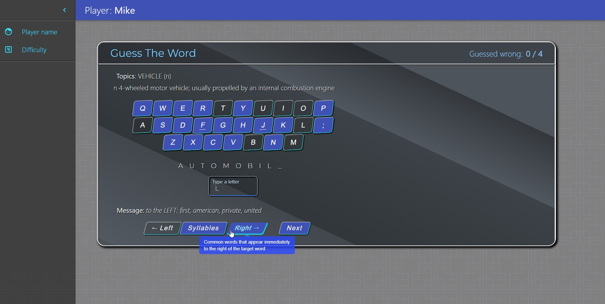
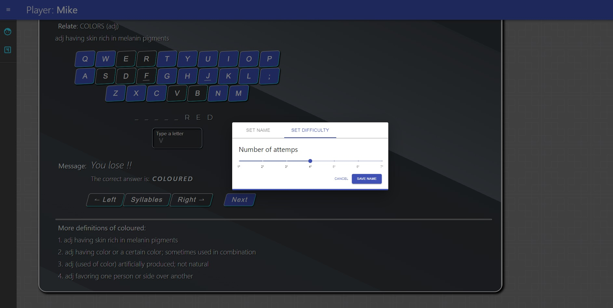
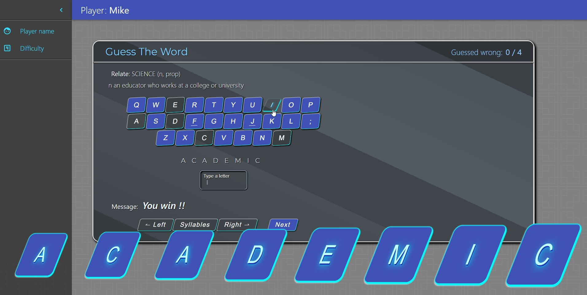

# [Guessed-The-Word](https://michal-w-dev.github.io/Guess-The-Word/)

## About the App

A simple app to improve ones english vocabulary. You can make guesses, look for hints or set difficult level.

## App development

Main technology - `TypeScript, React`\
State management - `Context`\
Styling - `Material UI, Styled-Components`

## Images

#

#

#